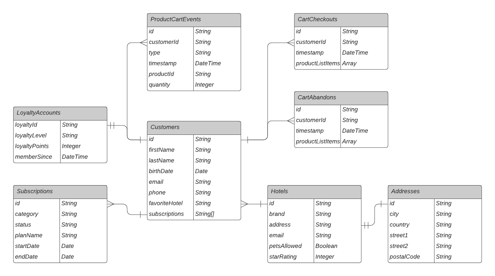

# Best practices for data modeling in Adobe Experience Platform

[!DNL Experience Data Model] (XDM) is the core framework that standardizes customer experience data by providing common structures and definitions for use in downstream Adobe Experience Platform services. By adhering to XDM standards, all customer experience data can be incorporated into a common representation that allows you to gain valuable insights from customer actions, define customer audiences through segments, and express customer attributes for personalization purposes.

Due to the fact that XDM is extremely versatile and customizable by design, it is therefore important to follow best practices for data modeling when designing your schemas. This document covers the key decisions and considerations you must make when mapping your customer experience data to XDM.

## Getting started

Before reading this guide, please review the [XDM System overview](../home.md) for a high-level introduction to XDM and its role within Experience Platform.

This guide focuses exclusively on key considerations regarding schema design. It is therefore strongly recommended that you refer to the [basics of schema composition](./composition.md) for detailed explanations of the individual schema elements mentioned throughout this guide.

## Best practices summary

The recommended approach for designing your data model for use in Experience Platform can be summarized as follows:

1. Understand the business use cases for your data.
1. Identify the primary data sources that should be brought into Platform to address those use cases.
1. Identify any secondary data sources that could also be of interest. For example, if currently only one business unit in your organization is interested in porting their data to Platform, a similar business unit might also be interested in porting similar data in the future. Considering these secondary sources helps standardize the data model across your entire organization.
1. Create a high-level entity relationship diagram (ERD) for the data sources that have been identified.
1. Convert the high-level ERD into a Platform-centric ERD (including profiles, Experience Events, and lookup entities).

The steps related to identifying the applicable data sources required to carry out your business use cases will vary from organization to organization. While the remainder of sections throughout this document focus on the latter steps of organizing and constructing an ERD after the data sources have been identified, the explanations of the diagram's various components may inform your decisions as to which of your data sources should be migrated to Platform.

## Create a high-level ERD

Once you have determined the data sources you wish to bring into [!DNL Platform], create a high-level ERD to help guide the process of mapping your data to XDM schemas.

The example below represents a simplified ERD for a company who wants to bring data into [!DNL Platform]. The diagram highlights the essential entities that should be sorted into XDM classes, including customer accounts, hotels, addresses, and several common e-commerce events.

## Sort entities into profile, lookup, and event categories

Once you have created an ERD to identify the essential entities you would like to bring into [!DNL Platform], these entities must be sorted into profile, lookup, and event categories:

| Category | Description |
| --- | --- |
| Profile entities | Profile entities represent attributes relating to an individual person, typically a customer. Entities that fall under this category should be represented by schemas based on the [!DNL XDM Individual Profile] class. |
| Lookup entities | Lookup entities represent concepts that can relate to an individual person, but cannot be directly used to identify the individual. Entities that fall under this category should be represented by schemas based on custom classes. |
| Event entities | Event entities represent concepts related to actions a customer can take, system events, or any other concept where you may want to track changes over time. Entities that fall under this category should be represented by schemas based on the [!DNL XDM ExperienceEvent] class. |

The sections below provide further guidance for how to sort your entities into the above categories.

### Customer attributes

If an entity contains any attributes related to an individual customer, it is most likely a profile entity. Examples of customer attributes include:

* Personal details such as name, birthdate, and gender.
* Location information such as addresses and GPS information.
* Contact information such as phone numbers and email addresses.

### Tracking data over time

If you want to analyze how certain attributes within an entity change over time, it is most likely an event entity. For example, adding product items to a cart can be tracked as add-to-cart events in [!DNL Platform]:

| Customer ID | Type | Product ID | Quantity | Timestamp |
| --- | --- | --- | --- | --- |
| 1234567 | Add | 275098 | 2 | Oct 1, 10:32 AM |
| 1234567 | Remove | 275098 | 1 | Oct 1, 10:33 AM |
| 1234567 | Add | 486502 | 1 | Oct 1, 10:41 AM |

### Segmentation use cases

When categorizing your entities, it is important to think about the audience segments you may want to build to address your particular business use cases.

For example, a company wants to know all of the "Gold" or "Platinum" members of their loyalty program that have made more than five purchases in the last year. Based on this segment logic, the following conclusions can be made regarding how relevant entities should be represented:

### Activation use cases

### Aggregated values

### Cardinality

## Create schemas based on your categorized entities

## Next steps