# Create a schema using the [!DNL Schema Editor]

The Adobe Experience Platform user interface allows you to create and manage [!DNL Experience Data Model] (XDM) schemas in an interactive visual canvas called the [!DNL Schema Editor]. This tutorial covers how to create a schema using the [!DNL Schema Editor].

>[!NOTE]
>
>For demonstration purposes, the steps in this tutorial involve creating an example schema that describes members of a customer loyalty program. While you can use these steps to create a different schema for your own purposes, it is recommended that you first follow along with creating the example schema to learn the capabilities of the [!DNL Schema Editor].

If you prefer to compose a schema using the [!DNL Schema Registry] API instead, start by reading the [[!DNL Schema Registry] developer guide](../api/getting-started.md) before attempting the tutorial on [creating a schema using the API](create-schema-api.md).

## Getting started

This tutorial requires a working understanding of the various aspects of Adobe Experience Platform involved in schema creation. Before beginning this tutorial, please review the documentation for the following concepts:

* [[!DNL Experience Data Model (XDM)]](../home.md): The standardized framework by which [!DNL Platform] organizes customer experience data.
    * [Basics of schema composition](../schema/composition.md): An overview of XDM schemas and their building blocks, including classes, mixins, data types, and fields.
* [[!DNL Real-time Customer Profile]](../../profile/home.md): Provides a unified, real-time consumer profile based on aggregated data from multiple sources.

## Open the [!UICONTROL Schemas] workspace {#browse}

The [!UICONTROL Schemas] workspace in the [!DNL Platform] UI provides a visualization of the [!DNL Schema Library], allowing you to view manage the schemas available for your organization. The workspace also includes the [!DNL Schema Editor], the canvas on which you can compose a schema throughout this tutorial.

After logging into [!DNL Experience Platform], select **[!UICONTROL Schemas]** in the left navigation to open the **[!UICONTROL Schemas]** workspace. The **[!UICONTROL Browse]** tab displays a list of schemas (a representation of the [!DNL Schema Library]) which you can view and customize. The list includes the name, type, class, and behavior (record or time-series) on which the schema is based, as well as the date and time the schema was last modified. 

See the guide on [exploring existing XDM resources in the UI](../ui/explore.md) for more information.

## Create and name a schema {#create}

To begin composing a schema, select **[!UICONTROL Create schema]** in the top-right corner of the **[!UICONTROL Schemas]** workspace. A dropdown menu appears, giving you the option to choose between the core classes [!UICONTROL XDM Individual Profile] and [!UICONTROL XDM ExperienceEvent]. If these classes do not suit your purposes, you can also select **[!UICONTROL Browse]** to choose from other available classes or [create a new class](#create-new-class).

For the purposes of this tutorial, select **[!UICONTROL XDM Individual Profile]**.

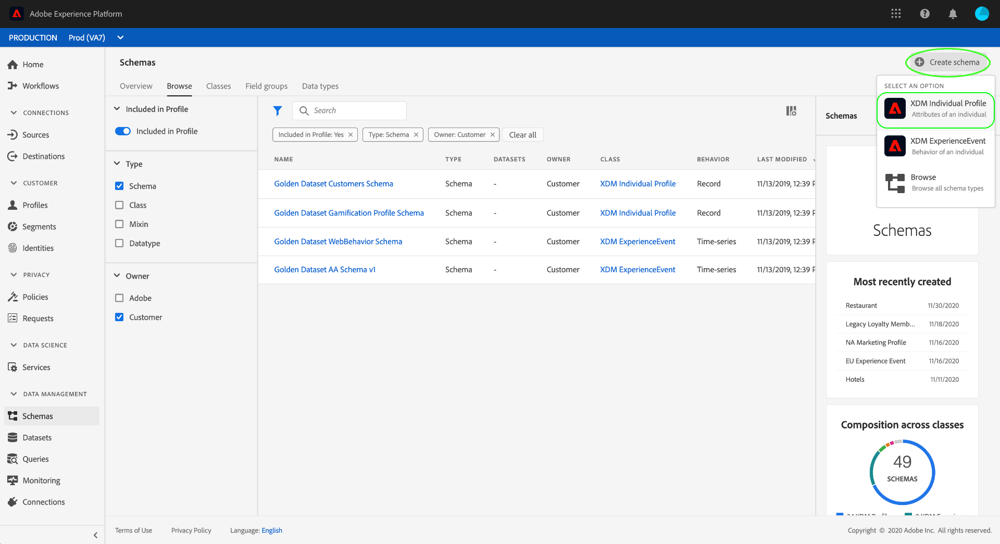

The [!DNL Schema Editor] appears. This is the canvas upon which you will compose your schema. Since you chose a standard XDM class to base the schema on, an untitled schema is automatically created in the **[!UICONTROL Structure]** section of the canvas when you arrive in the editor, along with the standard fields included in all schemas based on that class. The assigned class for the schema is also listed under **[!UICONTROL Class]** in **[!UICONTROL Composition]** section. 

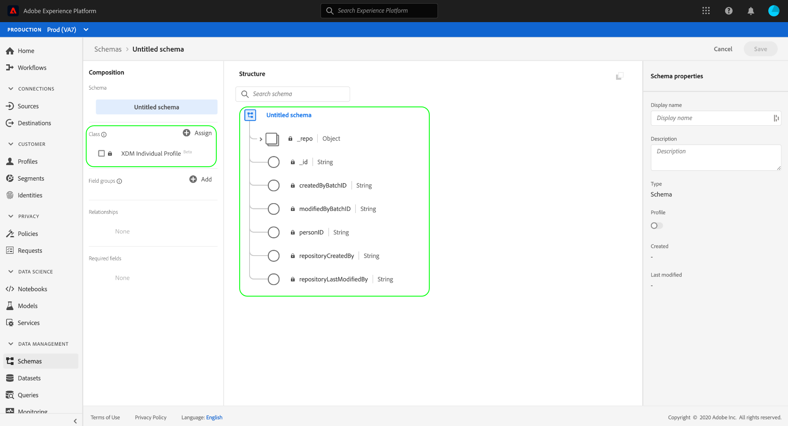

>[!NOTE]
>
>You can [change the class of a schema](#change-class) at any point during the initial composition process before the schema has been saved, but this should be done with extreme caution. Mixins are only compatible with certain classes, and therefore changing the class will reset the canvas and any fields you have added.

Use the fields on the right-hand side of the editor to provide a display name and optional description for the schema. Once a name is entered, the canvas updates to reflect the new name of the schema.

There are several important considerations to make when deciding on a name for your schema:

* Schema names should be short and descriptive so that the schema can be easily found later. 
* Schema names must be unique, meaning it should also be specific enough that it will not be reused in the future. For example, if your organization had separate loyalty programs for different brands, it would be wise to name your schema "Brand A Loyalty Members" to make it easy to distinguish from other loyalty-related schemas you might define later.
* You can also use the schema description to provide any additional contextual information regarding the schema.

This tutorial composes a schema to ingest data related to the members of a loyalty program, and therefore the schema is named "Loyalty Members".

## Add a mixin {#mixin}

You can now begin to add fields to your schema by adding mixins. A mixin is a group of one or more fields that are often used together to describe a particular concept. This tutorial uses mixins to describe the members of the loyalty program and capture key information such as name, birthday, phone number, address, and more.

To add a mixin, select **[!UICONTROL Add]** in the **[!UICONTROL Mixins]** sub-section.

A new dialog appears, displaying a list of available mixins. Each mixin is only intended for use with a specific class, therefore the dialog only lists mixins that are compatible with the class you selected (in this case, the [!DNL XDM Individual Profile] class). If you are using a standard XDM class, the list of mixins will be intelligently sorted based on usage popularity.

Selecting a mixin from the list causes it to appear in the right-hand rail. You can select multiple mixins if desired, adding each one to the list in the right rail before confirming. In addition, an icon appears on the right-hand side of the currently selected mixin which allows you to preview the structure of the fields it provides.

When previewing a mixin, a detailed description of the mixin's schema is provided in the right-hand rail. You can also navigate through the mixin's fields in the provided canvas. As you select different fields, the right rail updates to show details about the field in question. Select **[!UICONTROL Back]** when you are finished previewing to return to the mixin selection dialog. 

For this tutorial, select the **[!UICONTROL Demographic Details]** mixin, then select **[!UICONTROL Add mixin]**.

The schema canvas reappears. The **[!UICONTROL Mixins]** section now lists "[!UICONTROL Demographic Details]" and the **[!UICONTROL Structure]** section includes the fields contributed by the mixin. You can select the mixin's name under the **[!UICONTROL Mixins]** section to highlight the specific fields it provides within the canvas.

This mixin contributes several fields under the top-level name `person` with the data type "[!UICONTROL Person]". This group of fields describes information about an individual, including name, birth date, and gender. 

>[!NOTE]
>
>Remember that fields may use scalar types (such as string, integer, array, or date), as well as any data type (a group of fields representing a common concept) defined within the [!DNL Schema Registry]. 

Notice that the `name` field has a data type of "[!UICONTROL Person name]", meaning it too describes a common concept and contains name-related sub-fields such as first name, last name, courtesy title, and suffix.

Select the different fields within the canvas to reveal any additional fields they contribute to the schema structure.

## Add another mixin {#mixin-2}

You can now repeat the same steps to add another mixin. When you view the **[!UICONTROL Add mixin]** dialog this time, notice that the "[!UICONTROL Demographic Details]" mixin has been greyed out and the checkbox next to it cannot be selected. This prevents you from accidentally duplicating mixins that you have already included in the current schema.

For this tutorial, select the "[!DNL Personal Contact Details]" mixin from the dialog, then select **[!UICONTROL Add mixin]** to add it to the schema.

Once added, the canvas reappears. "[!UICONTROL Personal Contact Details]" is now listed under **[!UICONTROL Mixins]** in the **[!UICONTROL Composition]** section, and fields for home address, mobile phone, and more have been added under **[!UICONTROL Structure]**.

Similar to the `name` field, the fields you just added represent multi-field concepts. For example, `homeAddress` has a data type of "[!UICONTROL Postal address]" and `mobilePhone` has a data type of "[!UICONTROL Phone number]". You can select each of these fields to expand them and see the additional fields included in the data type.

## Define a new mixin {#define-mixin}

The "[!UICONTROL Loyalty Members]" schema is meant to capture data related to the members of a loyalty program, so it will require some specific loyalty-related fields. There are no standard mixins available that contain the necessary fields, therefore you will need to define a new mixin.

This time, when you open the **[!UICONTROL Add Mixin]** dialog, select **[!UICONTROL Create New Mixin]**. You will then be asked to provide a display name and description for your mixin. 

As with class names, the mixin name should be short and simple, describing what the mixin will contribute to the schema. These too are unique, so you will not be able to reuse the name and must therefore ensure it is specific enough. 

For this tutorial, name the new mixin "Loyalty Details".

Select **[!UICONTROL Add mixin]** to return to the [!DNL Schema Editor]. "[!UICONTROL Loyalty Details]" should now appear under **[!UICONTROL Mixins]** on the left-side of the canvas, but there are no fields associated with it yet and therefore no new fields appear under **[!UICONTROL Structure]**.

## Add fields to the mixin {#mixin-fields}

Now that you have created the "Loyalty Details" mixin, it is time to define the fields that the mixin will contribute to the schema.

To begin, select the mixin name in the **[!UICONTROL Mixins]** section. Once you do this, the mixin's properties appear on the right-hand side of the editor and a **plus (+)** icon appears next to the name of the schema under **[!UICONTROL Structure]**.

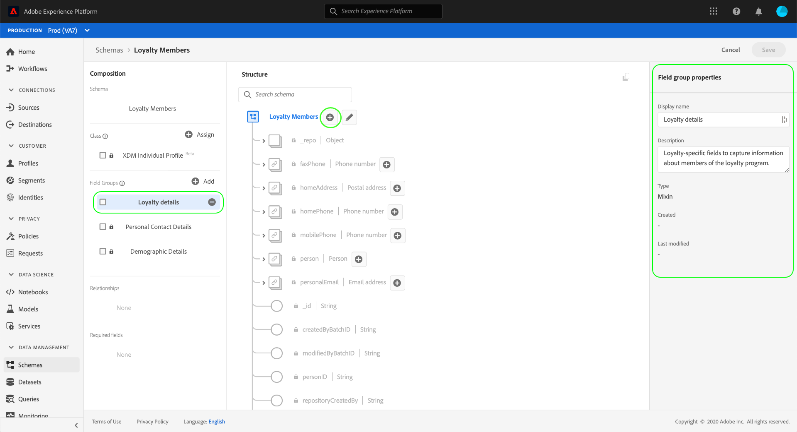

Select the **plus (+)** icon next to "[!DNL Loyalty Members]" to create a new node in the structure. This node (called `_tenantId` in this example) represents your IMS Organization's tenant ID, preceded by an underscore. The presence of the tenant ID indicates that the fields you are adding are contained in your organization's namespace. 

In other words, the fields you are adding are unique to your organization and are going to be saved in the [!DNL Schema Registry] in a specific area accessible only to your organization. Fields you define must always be added to your tenant namespace to prevent collisions with names from other standard classes, mixins, data types, and fields.

Inside that namespaced node is a "[!UICONTROL New Field]". This is the beginning of the "[!UICONTROL Loyalty Details]" mixin.

Using the controls on the right-hand side of the editor, start by creating a `loyalty` field with type "[!UICONTROL Object]" that will be used to hold your loyalty-related fields. When finished, select **[!UICONTROL Apply]**.

The changes are applied and the newly created `loyalty` object appears. Select the **plus (+)** icon next to the object to add additional loyalty-related fields. A "[!UICONTROL New Field]" appears and the **[!UICONTROL Field properties]** section is visible on the right-hand side of the canvas.

Each field requires the following information:

* **[!UICONTROL Field Name]:** The name of the field, written in camel case. Example: loyaltyLevel
* **[!UICONTROL Display Name]:** The name of the field, written in title case. Example: Loyalty Level
* **[!UICONTROL Type]:** The data type of the field. This includes basic scalar types and any data types defined in the [!DNL Schema Registry]. Examples: [!UICONTROL String], [!UICONTROL Integer], [!UICONTROL Boolean], [!UICONTROL Person], [!UICONTROL Address], [!UICONTROL Phone number], etc.
* **[!UICONTROL Description]:** An optional description of the field should be included, written in sentence case, with a maximum of 200 characters.

The first field for the `Loyalty` object will be a string called `loyaltyId`. When setting the new field's type to "[!UICONTROL String]", the **[!UICONTROL Field properties]** section becomes populated with several options for applying constraints, including default value, format, and maximum length.

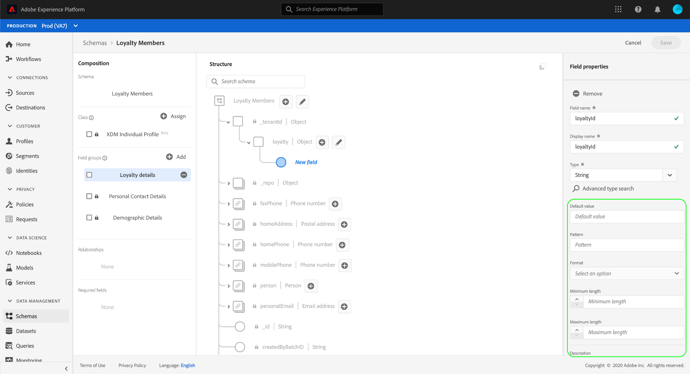

Different constraint options are available depending on the data type selected. Since `loyaltyId` will be an email address, select "[!UICONTROL email]" from the **[!UICONTROL Format]** dropdown menu. Select **[!UICONTROL Apply]** to apply your changes.

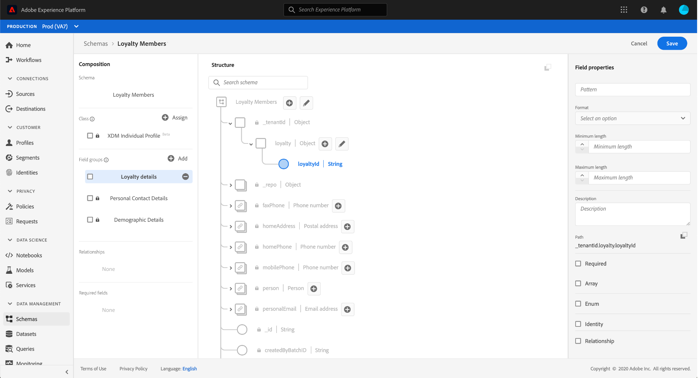

## Add more fields to the mixin {#mixin-fields-2}

Now that you have added the `loyaltyId` field, you can add additional fields to capture loyalty-related information such as:

* Points (integer)
* Member-since (date)

To add each field to the schema, select the **plus (+)** icon next to the `loyalty` object and fill in the required information.

When complete, the Loyalty object will contain fields for loyalty ID, points, and member-since.

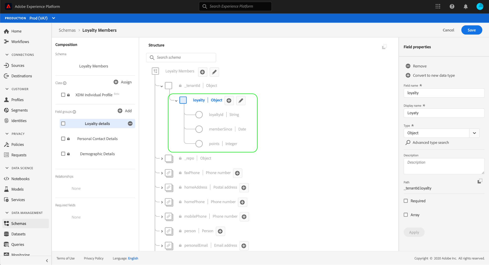

## Add an enum field to the mixin {#enum}

When defining fields in the [!DNL Schema Editor], there are some additional options that you can apply to basic field types in order to provide further constraints on the data the field can contain. The use cases for these constrains are explained in the following table:

| Constraint | Description |
| --- | --- |
| [!UICONTROL Required] | Indicates that the field is required for data ingestion. Any data uploaded to a dataset based on this schema that does not contain this field will fail upon ingestion. |
| [!UICONTROL Array] | Indicates that the field contains an array of values, each with the data type specified. For example, using this constraint on a field with a data type of "[!UICONTROL String]" specifies that the field will contain an array of strings. |
| [!UICONTROL Enum] | Indicates that this field must contain one of the values from an enumerated list of possible values.   |
| [!UICONTROL Identity] | Indicates that this field is an identity field. More information regarding identity fields is provided [later in this tutorial](#identity-field). |
| [!UICONTROL Relationship] | While schema relationships can be inferred through the use of the union schema and [!DNL Real-time Customer Profile], this only applies to schemas that share the same class. The [!UICONTROL Relationship] constraint indicates that this field references the primary identity of a schema based on a different class, implying a relationship between the two schemas. See the tutorial on [defining a relationship](./relationship-ui.md) for more information. |

>[!NOTE]
>
>Any required, identity, or relationship fields are shown in the left rail, allowing you to locate these fields easily regardless of the schema's complexity.
>
>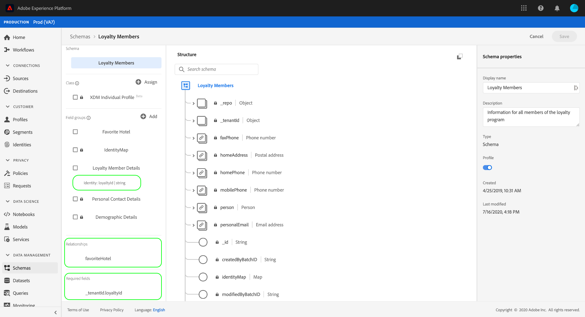

For this tutorial, the [!DNL "loyalty"] object in the schema requires a new enum field that describes the "loyalty level" of a customer, where the value can only be one of four possible options. To add this field to the schema, select the **plus (+)** icon beside the `loyalty` object and fill in the required fields for **[!UICONTROL Field name]** and **[!UICONTROL Display name]**. For **[!UICONTROL Type]**, select "[!UICONTROL String]".

Additional checkboxes appear for the field after its type has been selected, including checkboxes for **[!UICONTROL Array]**, **[!UICONTROL Enum]**, and **[!UICONTROL Identity]**. 

Select the **[!UICONTROL Enum]** checkbox to open the **[!UICONTROL Enum values]** section below. Here you can input the **[!UICONTROL Value]** (in camelCase) and **[!UICONTROL Label]** (an optional, reader-friendly name in Title Case) for each acceptable loyalty level.

When you have completed all field properties, select **[!UICONTROL Apply]** to add the "[!DNL loyaltyLevel]" field to the `loyalty` object.

## Convert a multi-field object into a data type {#datatype}

The `loyalty` object now contains several loyalty-specific fields, and represents a common data structure that could be useful in other schemas. The [!DNL Schema Editor] allows you to readily apply reusable multi-field objects by converting the structure of those objects into data types. 

Data types allow for the consistent use of multi-field structures and provide more flexibility than a mixin because they can be used anywhere within a schema. This is done by setting the field's **[!UICONTROL Type]** value to that of any data type defined in the [!DNL Schema Registry].

To convert the `loyalty` object to a data type, select the `loyalty` field under **[!UICONTROL Structure]**, then select **[!UICONTROL Convert to new data type]** on the right-hand side of the editor under **[!UICONTROL Field properties]**. A green popover appears, confirming that the object has been successfully converted. 

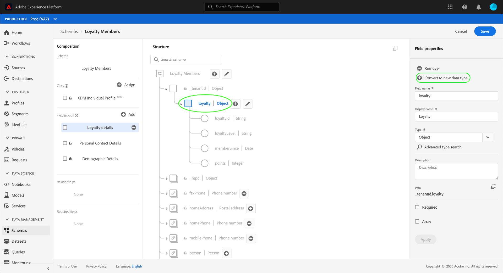

Now, when you look under **[!UICONTROL Structure]**, you can see that the `loyalty` field has a data type of "[!DNL Loyalty]" and the fields have small lock icons beside them, indicating they are no longer individual fields but rather part of a multi-field data type.

In a future schema, you could now assign a field as a "[!DNL Loyalty]" type and it would automatically include fields for ID, loyalty level, member since, and points.

>[!NOTE]
>
>You can also create and edit custom data types independently from editing schemas. See the guide on [creating and editing data types](../ui/resources/data-types.md) for more information.

## Search and filter schema fields

Your schema now contains several mixins in addition to the fields provided by its base class. When working with larger schemas, you can select the checkboxes next to mixin names in the left rail to filter the displayed fields to only those provided by the mixins you are interested in.

If you are looking for a specific field in your schema, you can also use the search bar to filter displayed fields by name, regardless of which mixin they are provided under.

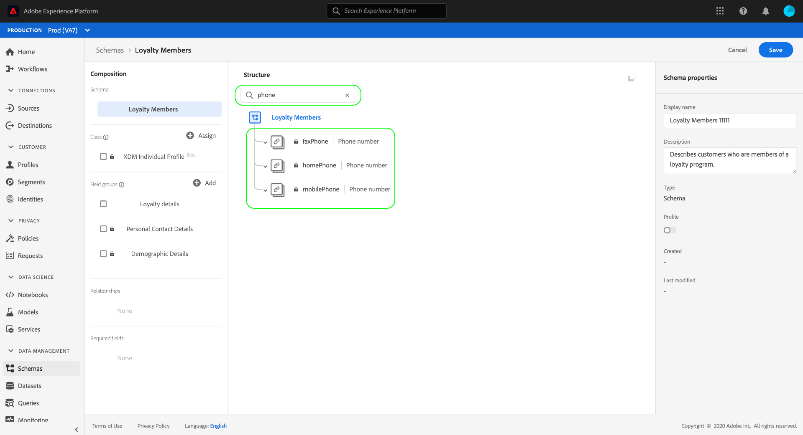

>[!IMPORTANT]
>
>The search function takes any selected mixin filters into account when displaying matching fields. If a search query is not displaying the results you expect, you may need to double-check that you are not filtering out any relevant mixins.

## Set a schema field as an identity field {#identity-field}

The standard data structure that schemas provide can be leveraged to identify data belonging to the same individual across multiple sources, allowing for various downstream use cases such as segmentation, reporting, data science analysis, and more. In order to stitch data based on individual identities, key fields must be marked as [!UICONTROL Identity] fields within applicable schemas. 

[!DNL Experience Platform] makes it easy to denote an identity field through the use of an **[!UICONTROL Identity]** checkbox in the [!DNL Schema Editor]. However, you must determine which field is the best candidate to use as an identity, based on the nature of your data.

For example, there may be thousands of loyalty program members belonging to the same "loyalty level", but each member of the loyalty program has a unique `loyaltyId` (which in this instance is the individual member's email address). The fact that `loyaltyId` is a unique identifier for each member makes it a good candidate for an identity field, whereas `loyaltyLevel` is not.

>[!IMPORTANT]
>
>The steps outlined below cover how to add an identity descriptor to an existing schema field. As an alternative to defining identity fields within the structure of the schema itself, you can also use an `identityMap` field to contain identity information instead.
>
>If you plan on using `identityMap`, keep in mind that it will override any primary identity you add to the schema directly. See the section on `identityMap` in the [basics of schema composition guide](../schema/composition.md#identityMap) for more information. 

In the **[!UICONTROL Structure]** section of the editor, select the `loyaltyId` field and the **[!UICONTROL Identity]** checkbox appears under **[!UICONTROL Field properties]**. Check the box and the option to set this as the **[!UICONTROL Primary identity]** appears. Select this box as well. 

>[!NOTE]
>
>Each schema may contain only one primary identity field. Once a schema field has been set as the primary identity, you will receive an error message if you later attempt to set another identity field in the schema as the primary.

Next, you must provide an **[!UICONTROL Identity namespace]** from the list of pre-defined namespaces in the dropdown. Since `loyaltyId` is the customer's email address, select "[!UICONTROL Email]" from the dropdown. Select **[!UICONTROL Apply]** to confirm the updates to the `loyaltyId` field.

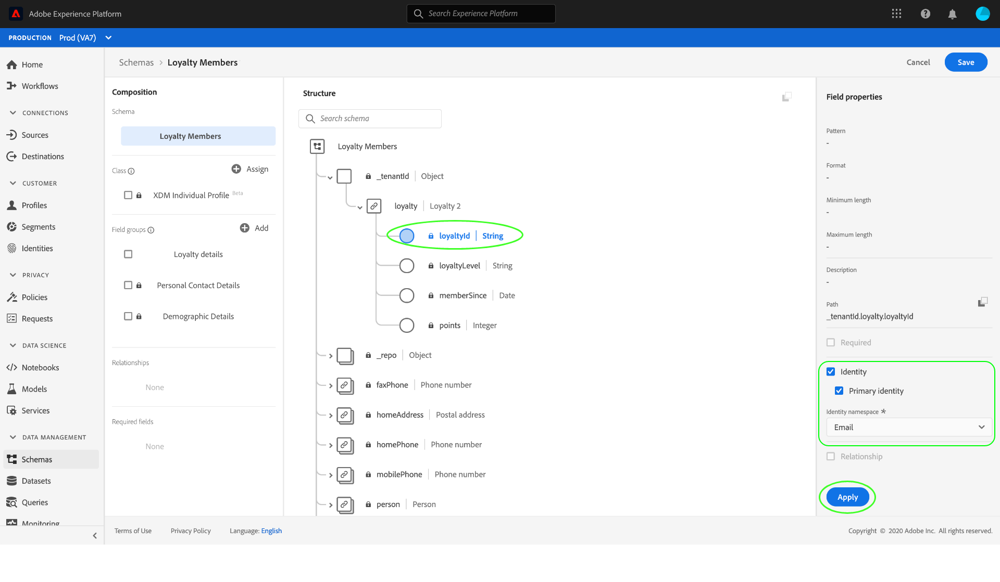

>[!NOTE]
>
>For a list of standard namespaces and their definitions, see the [[!DNL Identity Service] documentation](../../identity-service/troubleshooting-guide.md#standard-namespaces).

After applying the change, the icon for `loyaltyId` shows a fingerprint symbol, indicating that it is now an identity field.

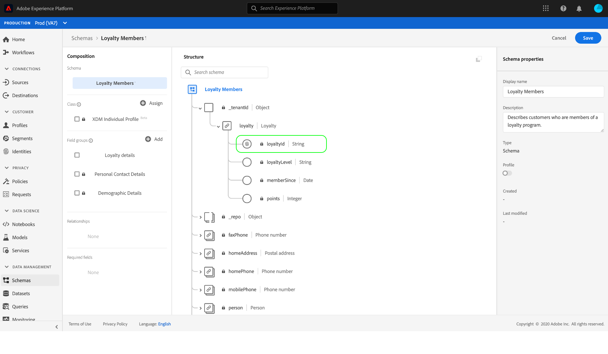

Now all data ingested into the `loyaltyId` field will be used to help identify that individual and stitch together a single view of that customer. To learn more about working with identities in [!DNL Experience Platform], please review the [[!DNL Identity Service]](../../identity-service/home.md) documentation.

## Enable the schema for use in [!DNL Real-time Customer Profile] {#profile}

[[!DNL Real-time Customer Profile]](../../profile/home.md) leverages identity data in [!DNL Experience Platform] to provide a holistic view of each individual customer. The service builds robust, 360&deg; profiles of customer attributes as well as timestamped accounts of every interaction customers have had across any system integrated with [!DNL Experience Platform]. 

In order for a schema to be enabled for use with [!DNL Real-time Customer Profile], it must have a primary identity defined. You will receive an error message if you attempt to enable a schema without first defining a primary identity.

 

To enable the "Loyalty Members" schema for use in [!DNL Profile], begin by selecting "[!DNL Loyalty Members]" in the **[!UICONTROL Structure]** section of the editor. 

On the right-hand side of the editor, information is shown about the schema including its display name, description, and type. In addition to this information, there is a **[!UICONTROL Profile]** toggle button.

Select **[!UICONTROL Profile]** and a popover appears, asking you to confirm that you wish to enable the schema for [!DNL Profile]. 

 

>[!WARNING]
>
>Once a schema has been enabled for [!DNL Real-time Customer Profile] and saved, it cannot be disabled.

Select **[!UICONTROL Enable]** to confirm your choice. You can select the **[!UICONTROL Profile]** toggle again to disable the schema if you wish, but once the schema has been saved while [!DNL Profile] is enabled, it can no longer be disabled.

## Next steps and additional resources

Now that you have finished composing the schema, you can see the complete schema in the canvas. Select **[!UICONTROL Save]** and the schema will be saved to the [!DNL Schema Library], making it accessible by the [!DNL Schema Registry].

Your new schema can now be used to ingest data into [!DNL Platform]. Remember that once the schema has been used to ingest data, only additive changes may be made. See the [basics of schema composition](../schema/composition.md) for more information on schema versioning.

You can now follow the tutorial on [defining a schema relationship in the UI](./relationship-ui.md) to add a new relationship field to the "Loyalty Members" schema.

The "Loyalty Members" schema is also available to be viewed and managed using the [!DNL Schema Registry] API. To begin working with the API, start by reading the [[!DNL Schema Registry API] developer guide](../api/getting-started.md).

### Video resources

>[!WARNING]
>
>The [!DNL Platform] UI shown in the following videos are out of date. Please refer to the documentation above for the latest UI screenshots and functionality.

The following video shows how to create a simple schema in the [!DNL Platform] UI.

>[!VIDEO](https://video.tv.adobe.com/v/27012?quality=12&learn=on)

The following video is intended to reinforce your understanding of working with mixins and classes.

>[!VIDEO](https://video.tv.adobe.com/v/27013?quality=12&learn=on)

## Appendix

The following sections provide addition information information regarding the use of the [!DNL Schema Editor].

### Create a new class {#create-new-class}

[!DNL Experience Platform] provides the flexibility to define a schema based on a class that is unique to your organization. To learn how to create a new class, see the guide on [creating and editing classes in the UI](../ui/resources/classes.md#create).

### Change the class of a schema {#change-class}

You can change the class of a schema at any point during the initial composition process before the schema has been saved.

>[!WARNING]
>
>Reassigning the class for a schema should be done with extreme caution. Mixins are only compatible with certain classes, and therefore changing the class will reset the canvas and any fields you have added. 

To learn how to change the class of a schema, see the guide on [managing schemas in the UI](../ui/resources/schemas.md).