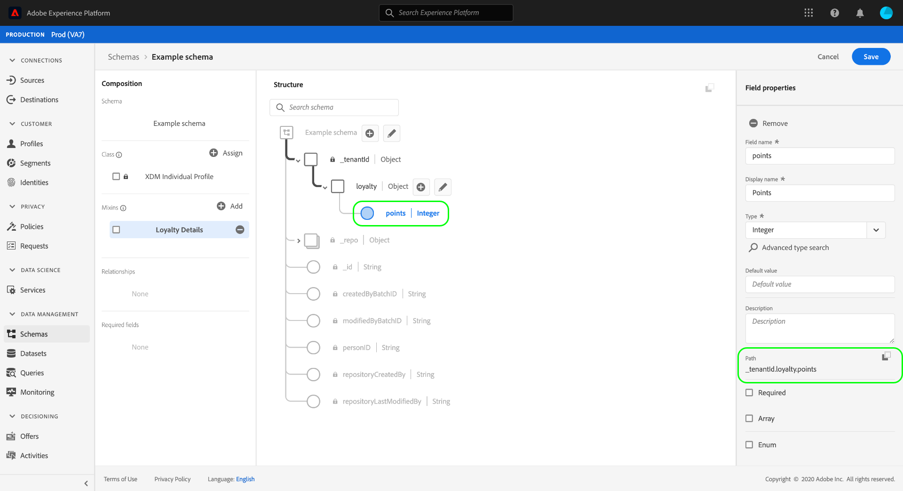

# Define XDM fields in the UI

## Prerequisites

<!-- The steps outlined below assume that you have already selected a custom class or mixin that you want to define fields for. See the sections on [adding fields to a class](../resources/classes.md#add-fields) and [adding fields to a mixin](../resources/mixins.md#add-fields) to get started. -->

## Select a resource to add fields to {#select-resource}

## Define fields for the resource {#define}

After selecting the **plus (+)** icon, a **[!UICONTROL New field]** appears in in the canvas, located within a root-level object that is namespaced to your unique tenant ID (shown as `_tenantId` in the example below). All fields that are added to a schema through custom classes and mixins are automatically placed within this namespace, in order to prevent conflicts with other fields from Adobe-provided classes and mixins.

In the right rail, you can configure the details of the new fields. The following information is required for each field:

| Field property | Description |
| --- | --- |
| **[!UICONTROL Field name]** | The name for the field, written in camelCase. |
| **[!UICONTROL Display name]** | A human-friendly name for the field. |
| **[!UICONTROL Type]** | The type of data the field will contain. From this dropdown menu, you can select one of the [standard scalar types](../../schema/field-constraints.md) supported by XDM, or one of the multi-field [data types](./data-types.md) that have been previously defined in the [!DNL Schema Registry]. |

Once you have finished configuring the field, select **[!UICONTROL Apply]**.

The canvas updates to show the field's name and type, and the right rail now lists the field's path in addition to its other properties.

## Next steps