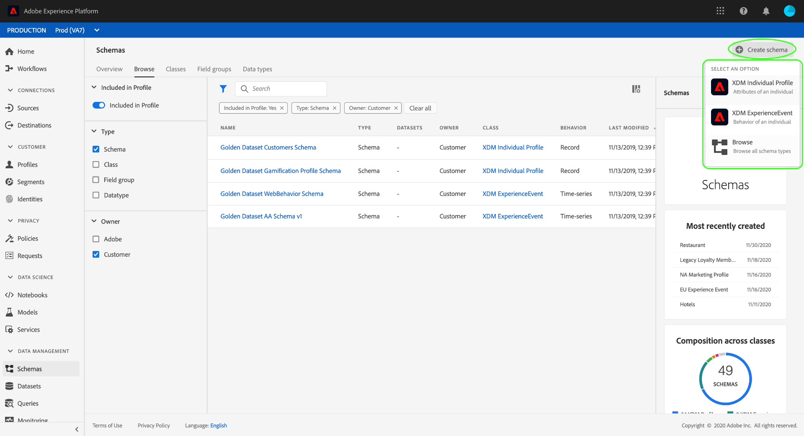
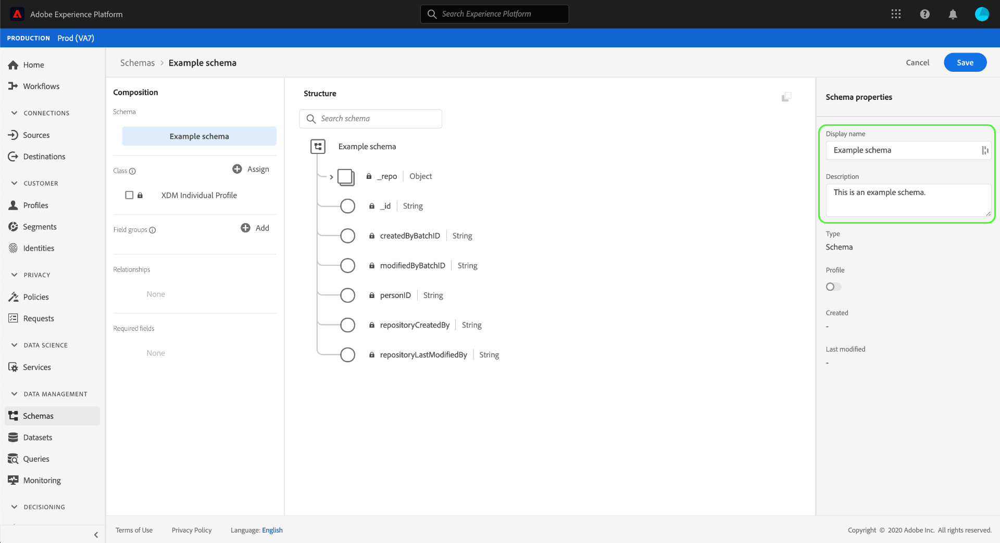
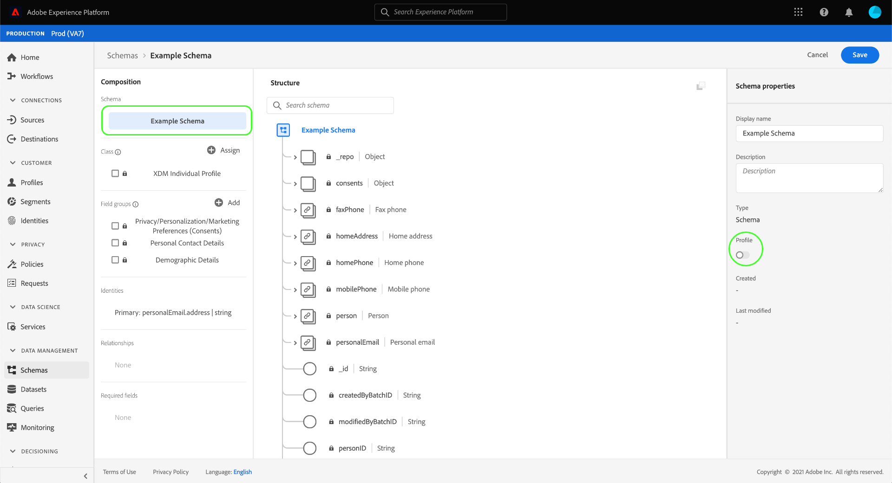
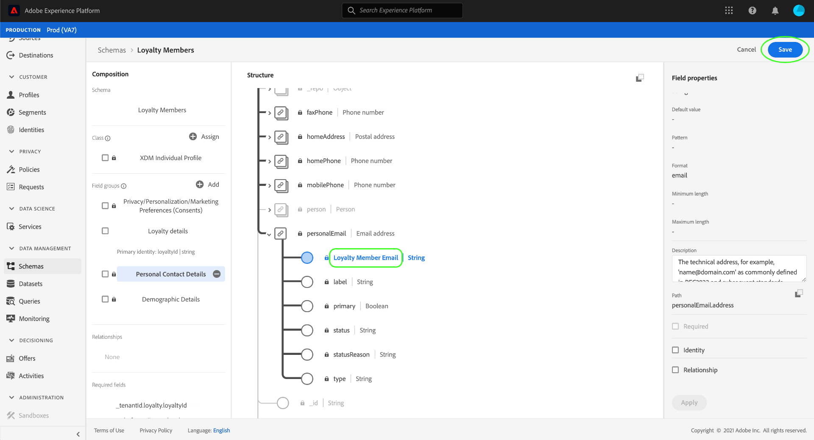
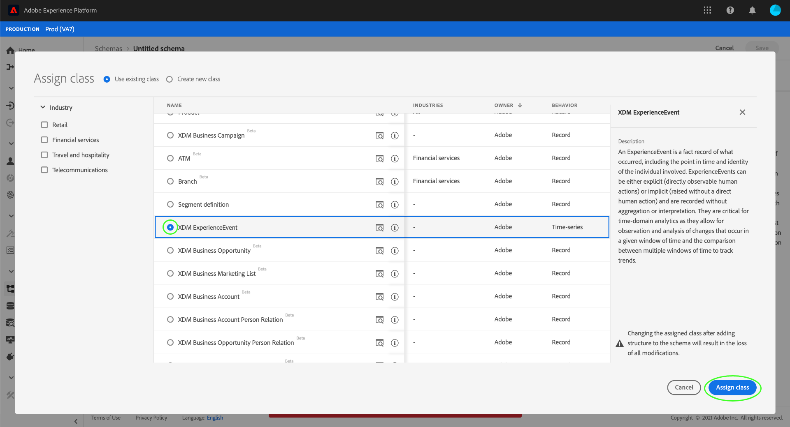

# Create and edit schemas in the UI

This guide provides an overview of how to create, edit, and manage Experience Data Model (XDM) schemas for your organization in the Adobe Experience Platform UI.

>[!IMPORTANT]
>
>XDM schemas are extremely customizable, and therefore the steps involved in creating a schema can vary depending on what kind of data you want the schema to capture. As a result, this document only covers the basic interactions you can make with schemas in the UI, and excludes related steps such as customizing classes, mixins, data types, and fields.
>
>For a full tour of the schema creation process, follow along with the [schema creation tutorial](../../tutorials/create-schema-ui.md) to create a complete example schema and familiarize yourself with the many capabilities of the [!DNL Schema Editor].

## Prerequisites

This guide requires a working understanding of XDM System. Refer to the [XDM overview](../../home.md) for an introduction to the role of XDM within the Experience Platform ecosystem, and the [basics of schema composition](../../schema/composition.md) for an overview of how schemas are constructed.

## Create a new schema {#create}

In the [!UICONTROL Schemas] workspace, select **[!UICONTROL Create schema]** in the top-right corner. In the dropdown that appears, you can choose between **[!UICONTROL XDM Individual Profile]** and **[!UICONTROL XDM ExperienceEvent]** as the base class for the schema. Alternatively, you can select **[!UICONTROL Browse]** to select from the full list of available classes, or [create a new custom class](./classes.md#create) instead.

Once you select a class, the [!DNL Schema Editor] appears and the schema's base structure (provided by the class) is shown in the canvas. From here, you can use the right rail to add a **[!UICONTROL Display name]** and **[!UICONTROL Description]** for the schema.

You can now start building the structure of the schema by [adding mixins](#add-mixins).

## Edit an existing schema {#edit}

>[!NOTE]
>
>Once a schema has been saved and used in data ingestion, only additive changes can be made to it. See the [rules of schema evolution](../../schema/composition.md#evolution) for more information.

To edit an existing schema, select the **[!UICONTROL Browse]** tab, and then select the name of the schema you want to edit.

>[!TIP]
>
>You can use the workspace's search and filtering capabilities to help find the schema easier. See the guide on [exploring XDM resources](../explore.md) for more information.

Once you select a schema, the [!DNL Schema Editor] appears with the schema's structure shown in the canvas. You can now [add mixins](#add-mixins) to the schema, [edit field display names](#display-names), or [edit existing custom mixins](./mixins.md#edit) if the schema employs any.

## Add mixins to a schema {#add-mixins}

>[!NOTE]
>
>This section covers how to add existing mixins to a schema. If you want to create a new custom mixin, see the guide on [creating and editing mixins](./mixins.md#create) instead.

Once you have opened a schema within the [!DNL Schema Editor], you can add fields to the schema through the use of mixins. To start, select **[!UICONTROL Add]** next to to **[!UICONTROL Mixins]** in the left rail.

A dialog appears, showing a list of mixins that you can select for the schema. Since mixins are only compatible with one class, only those mixins that are associated with the schema's selected class will be listed. By default, listed mixins are sorted based on their usage popularity within your organization.

You can use the search bar to help locate your desired mixin. Mixins whose name matches the query appear at the top of the list. Under **[!UICONTROL Standard Fields]**, mixins containing fields that describe desired data attributes are displayed.

Select the checkbox next to the name of the mixin that you wish to add to the schema. You can select multiple mixins from the list, with each selected mixin appearing in the right rail.

>[!TIP]
>
>For any listed mixin, you can hover or focus on the information icon () to view a brief description of the kind of data the mixin captures. You can also select the preview icon () to view the structure of the fields that the mixin provides before you decide to add it to the schema.

Once you have chosen your mixins, select **[!UICONTROL Add mixin]** to add them to the schema.

The [!DNL Schema Editor] reappears with the mixin-provided fields represented in the canvas.

## Enable a schema for Real-time Customer Profile {#profile}

[Real-time Customer Profile](../../../profile/home.md) merges data from disparate sources to construct a complete view of each individual customer. If you want the data captured by a schema to participate in this process, you must enable the schema for use in [!DNL Profile].

>[!IMPORTANT]
>
>In order to enable a schema for [!DNL Profile], it must have a primary identity field defined. See the guide on [defining identity fields](../fields/identity.md) for more information.

To enable the schema, start by selecting the schema's name in the left rail, then select the **[!UICONTROL Profile]** toggle in the right rail.

A popover appears, warning you that once a schema has been enabled and saved, it cannot be disabled. Select **[!UICONTROL Enable]** to continue.

The canvas reappears with the [!UICONTROL Profile] toggle enabled.

>[!IMPORTANT]
>
>Since the schema is not saved yet, this is the point of no return if you change your mind about letting the schema participate in Real-time Customer Profile: once you save an enabled schema, it can no longer be disabled. Select the **[!UICONTROL Profile]** toggle again to disable the schema.

To finish the process, select **[!UICONTROL Save]** to save the schema.

The schema is now enabled for use in Real-time Customer Profile. When Platform ingests data into datasets based on this schema, that data will be incorporated into your amalgamated Profile data.

## Edit display names for schema fields {#display-names}

Once you have assigned a class and added mixins to a schema, you can edit the display names of any of the schema's fields, regardless of whether those fields have been provided by standard or custom XDM resources.

>[!NOTE]
>
>Keep in mind that the display names of fields that belong to standard classes or mixins can only be edited in the context of a specific schema. In other words, changing the display name of a standard field in one schema does not effect other schemas that employ the same associated class or mixin.

To edit the display name of a schema field, select the field in the canvas. In the right rail, provide the new name under **[!UICONTROL Display name]**.

Select **[!UICONTROL Apply]** in the right rail, and the canvas updates to show the field's new display name. Select **[!UICONTROL Save]** to apply the changes to the schema.

## Change a schema's class {#change-class}

You can change the class of a schema at any point during the initial composition process before the schema has been saved.

>[!WARNING]
>
>Reassigning the class for a schema should be done with extreme caution. Mixins are only compatible with certain classes, and therefore changing the class will reset the canvas and any fields you have added. 

To reassign a class, select **[!UICONTROL Assign]** in the left-hand side of the canvas.

A dialog appears that displays a list of all available classes, including any defined by your organization (the owner being "[!UICONTROL Customer]") as well as standard classes defined by Adobe. 

Select a class from the list to display its description on the right-hand side of the dialog. You can also select **[!UICONTROL Preview class structure]** to see the fields and metadata associated with the class. Select **[!UICONTROL Assign class]** to continue.

A new dialog opens, asking you to confirm that you wish to assign a new class. Select **[!UICONTROL Assign]** to confirm.

After confirming the class change, the canvas will be reset and all composition progress will be lost.

## Next steps

This document covered the basics of creating and editing schemas in the Platform UI. It is strongly recommended that you review the [schema creation tutorial](../../tutorials/create-schema-ui.md) for a comprehensive workflow for building a complete schema in the UI, including creating custom mixins and data types for unique use cases.

For more information on the capabilities of the [!UICONTROL Schemas] workspace, see the [[!UICONTROL Schemas] workspace overview](../overview.md).

To learn how to manage schemas in the [!DNL Schema Registry] API, see the [schemas endpoint guide](../../api/schemas.md).
