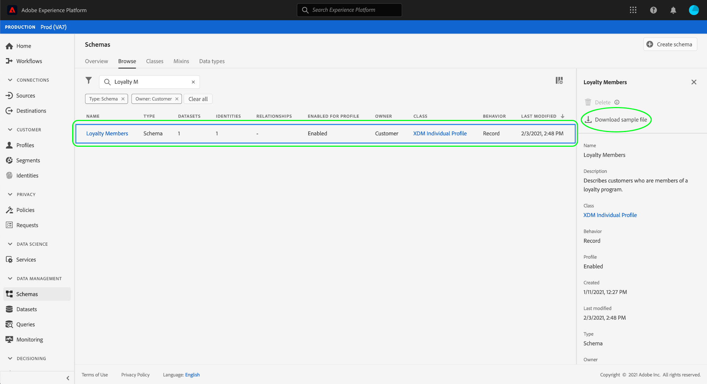

# Generate sample data for an XDM schema in the UI

In order to ingest data into Adobe Experience Platform, the format and structure of the data must comply with an existing Experience Data Model (XDM) schema. Depending on the complexity of the schema for a particular dataset, it can be difficult to determine the exact shape of the data that the dataset expects upon ingestion.

For any schema that you define in the Experience Platform UI, you can generate a sample JSON object that conforms to the schema's structure. This object can serve as a template for any data that is ingested into datasets that employ the schema in question.

In the Platform UI, select **[!UICONTROL Schemas]** in the left navigation. Under the **[!UICONTROL Browse]** tab, locate the schema that you want to generate sample data for. Select it from the list, and the right rail updates to show details about the schema. From here, select **[!UICONTROL Download sample file].**

A sample JSON file is downloaded by the browser. You can now use this file as a reference for how to structure your data when ingesting into datasets that employ this schema.

## Next steps

This guide covered how to generate a sample JSON file from an XDM schema in the Platform UI. To learn how to generate sample data using the Schema Registry API, see the [sample data endpoint guide](../api/sample-data.md).

Once you are ready to start ingesting data, see the tutorial on [mapping a CSV file to XDM](../../ingestion/tutorials/map-a-csv-file.md) to learn how to map a flat data file (such as a CSV) to an XDM schema and ingest it into Platform. Alternatively, you can establish a [source connection](../../sources/home.md) to bring in your data from an external source and map it to XDM.

For more information on the capabilities of the [!UICONTROL Schemas] workspace in the UI, refer to the [[!UICONTROL Schemas] workspace overview](./overview.md).